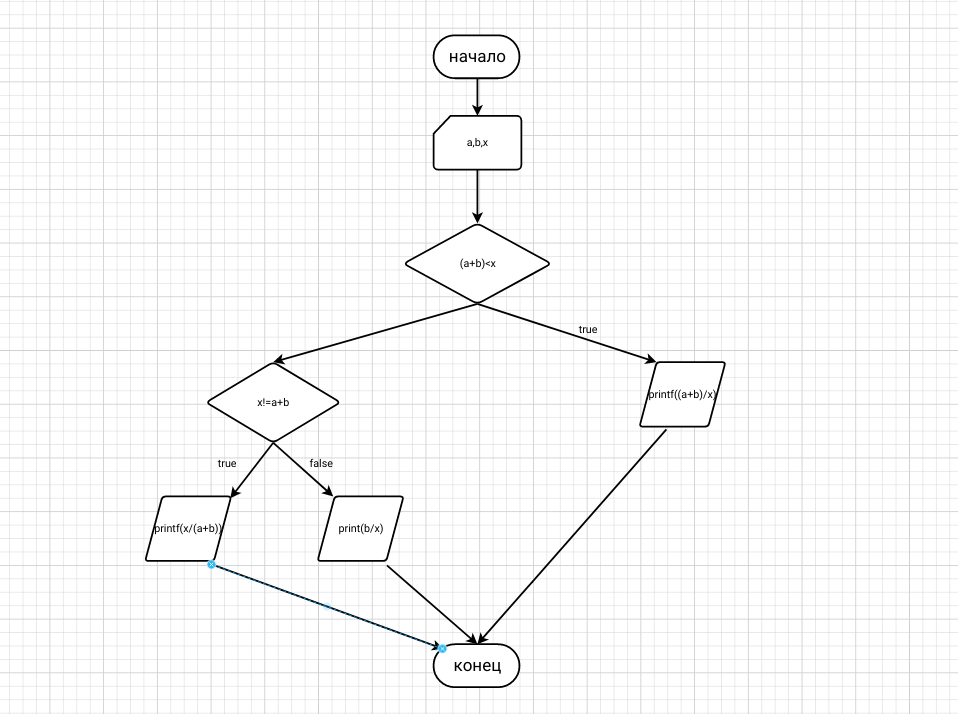

# Лабораторная работа 1

## Задания:

### Разберите код программы из примера.(Я разобрал код программы из пример)
### Составьте блок-схему алгоритма для своего варианта.

### Напишите программу, решающую задачу по своему варианту.
Вывести частное суммы параметров a, b и параметра x, если сумма меньше x, и обратное частное, если сумма больше. В случае равенства вывести частное b и x. Точность – 3 знака после запятой.
 ```
#include<stdio.h>
#include<math.h>
int main()
{
    float a, b, x;
    printf("Enter a -> ");
    scanf("%f", &a);
    printf("Enter b -> ");
    scanf("%f", &b);
    printf("Enter x -> ");
    scanf("%f", &x);
    if ((a+b)<x)
        {printf((a+b/x));
        return 0;}
    else
        if ((a+b)>x)
            {printf (x/(a+b));
            return 0;}
        else
            printf (b/x);
            return 0;
}
```

### Оформите отчёт в README.md. (готово)


